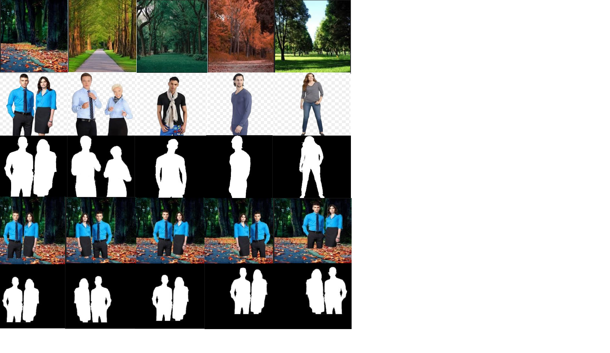

# EVA4_S15
Given an image with foreground objects and background image, predict the depth map as well as a mask for the foreground object

Table of contents :
1) Understanding the problem
2) Applications of depth estimation
3) Data preparation
4) Approaches to depth estimation
5) Findings
6) Conclusion

# Understanding the problem
Human brain has the remarkable ability to infer depth when viewing a two-dimensional scene (even in a photograph). But accurate depth mapping is a challenge in computer vision which computer vision enthusiasts are trying to solve. The problem I am trying to solve here is to do a monocular depth estimation and object segmentation using custom prepared dataset.

# Applications of depth estimation
Depth information from a scene is invaluable for tasks like augmented reality, robotics, self driving cars etc

# Data preparation
Drive link to dataset : https://drive.google.com/open?id=1Hr1OuftLZ0reDac1yJ2wAspwE9gnUQEi

bg : Forest, park, seashore and road. Total images = 100; Channels = RGB; Size = 905KB; Resolution = 224X224

fg : Men, Women, Children and combination of men-women, women-children and men-children. Total images = 100; Channels = RGB; Size = 576KB; Resolution = 160X160. Gimp is used to remove the background in foreground images(made transparent). Understood difference between white bg and transparent bg.

fg_bg : Randomly placed each fg 40 times(with flips) over each bg. Total images = [100X100X(20X2)] 400K. Channels = RGB; Size = 2.2GB; Resolution = 224X224

fg_bg_mask : fg is converted from RGB to black and overlaid on top of black background. This is done along with step 3 (in the same for loop). Total images = 400K. Size = 1.6GB; Resolution = 224X224

fg_bg_depth : Tweaks with respect to image input folder and save have been made from the shared Dense Depth code. Image loading is done on CPU while prediction is done on GPU. Need to load the data as well in GPU for fast processing. 2000 images takes 15 minutes hence working on optimizations. Could have done this in the same for loop along with steps 3 and 4.

# Approaches to depth estimation
